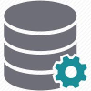

[](https://ci.appveyor.com/project/shaynevanasperen/nhibernate-sessions)
[](https://www.nuget.org/packages/Data.Operations)
[](https://www.nuget.org/packages/Data.Operations)
Data.Operations
===============

A data access library for .NET combining the [mediator pattern](https://en.wikipedia.org/wiki/Mediator_pattern)
and the [query object pattern](http://martinfowler.com/eaaCatalog/queryObject.html), with caching,
async and easy mocking of queries and commands. This library makes it easy to build and consume your
own query and command objects, with support for caching and result transformation. Rather than pairing
queries and commands to separate handlers, the query and command objects self-execute via a method
which takes a context argument. Query and command  objects derive from a `DataOperation` base class
which makes them behave like value objects so that when comparing two objects with the same property
values they are considered equal. This allows consuming classes to instantiate new commands and queries
instead of needing to have them supplied as dependencies, and is especially useful for setting up
mocks in unit tests. Here are the interfaces that define queries and commands:
```c#
public interface IDataQuery<in TContext, out TResult>
{
	TResult Execute(TContext context);
}

public interface IDataCommand<in TContext>
{
	void Execute(TContext context);
}

public interface IDataCommand<in TContext, out TResult>
{
	TResult Execute(TContext context);
}
```

The `IData` interface acts as a mediator and provides the means of invoking queries and commands in a
standaradized way. By using a mediator pattern like this we can reduce coupling and at the same time
provide a way for us to mock the invocations of queries and commands in unit tests. The `IData` interface
is composed of `ISyncData`, `IAsyncData`, `IQueryInvoker`, `ISyncQueryInvoker`, `IAsyncQueryInvoker`,
`ICommandInvoker`, `ISyncCommandInvoker` and `IAsyncCommandInvoker`, so you can choose the level of
granularity you want to expose to consuming classes. For the sake of brevity, I'll only show the contents
of the synchronous version of the API. The `ISyncQueryInvoker` exposes the following methods:
```c#
TResult Query<TContext, TResult>(IDataQuery<TContext, TResult> query, TContext context);

TResult Query<TContext, TCachedResult, TResult>(
    ICachedDataQuery<TContext, TCachedResult, TResult> query, TContext context, CacheOption cacheOption = CacheOption.Default);

void EvictCachedResult<TCachedResult>(ICachedDataQueryBase<TCachedResult> query);

void UpdateCachedResult<TCachedResult>(ICachedDataQueryBase<TCachedResult> executedQuery);
```
The `ISyncCommandInvoker` exposes the following methods:
```c#
void Command<TContext>(IDataCommand<TContext> command, TContext context);

TResult Command<TContext, TResult>(IDataCommand<TContext, TResult> command, TContext context);
```

As you can see from this, the consumer of this API is required to pass a context argument.
To avoid needing to do that, the `IData<TContext>` interface can be used instead. The `IData<TContext>`
interface is composed of `ISyncData<TContext>`, `IAsyncData<TContext>`, `IQueryInvoker<TContext>`,
`ISyncQueryInvoker<TContext>`, `IAsyncQueryInvoker<TContext>`, `ICommandInvoker<TContext>`,
`ISyncCommandInvoker<TContext>` and `IAsyncCommandInvoker<TContext>`, so again you can choose the
level of granularity you want to expose to consuming classes. The `ISyncQueryInvoker<TContext>` exposes
the following methods:
```c#
TResult Query<TContext, TResult>(IDataQuery<TContext, TResult> query);

TResult Query<TContext, TCachedResult, TResult>(
    ICachedDataQuery<TContext, TCachedResult, TResult> query, CacheOption cacheOption = CacheOption.Default);

void EvictCachedResult<TCachedResult>(ICachedDataQueryBase<TCachedResult> query);

void UpdateCachedResult<TCachedResult>(ICachedDataQueryBase<TCachedResult> executedQuery);
```
The `ISyncCommandInvoker<TContext>` exposes the following methods:
```c#
void Command<TContext>(IDataCommand<TContext> command);

TResult Command<TContext, TResult>(IDataCommand<TContext, TResult> command);
```

*The asynchronous versions of these methods are the same, except for their names ending with "Async" and
they return `Task` instances.*

##Creating an instance of the mediator
The `IData` interface can be used as a singleton and you can create an instance like this:
```c#
var data = new Data(new DataQueryCache(new MemoryCacheDefaultCacheStore()));
```
The `IDataQueryCache` parameter is optional, so can omit it if you don't want caching. The `IData<TContext>`
interface is implemented via composition and you can create an instance like this:
```c#
var data = new Data(new DataQueryCache(new MemoryCacheDefaultCacheStore())); // first create a non-context data
var contextData = new Data<ISession>(data, context); // then pass it into the context data
```

The `DataQueryCache` class is an implementation of `IDataQueryCache`, and you can provide your
own implementation if you wish. The constructor parameter for `DataQueryCache` is an implementation
of `ICacheStore`, which is composed of `ISyncCacheStore` and `IAsyncCacheStore`, defined as:
```c#
public interface ISyncCacheStore
{
	object GetItem(string cacheKey);
	void SetItem(string cacheKey, object item, TimeSpan absoluteDuration);
	void RemoveItem(string cacheKey);
}

public interface IAsyncCacheStore
{
	Task<object> GetItemAsync(string cacheKey);
	Task SetItemAsync(string cacheKey, object item, TimeSpan absoluteDuration);
	Task RemoveItemAsync(string cacheKey);
}
```

The example above uses an implementation called `MemoryCacheDefaultCacheStore` which simply leverages the
`MemoryCache.Default` object in the `System.Runtime.Caching` namespace. You can also provide your own
implementation of `ICacheStore` for customizing the caching behaviour or integrating a distributed cache.

##Using database queries and commands
Here's how to create and use database query and command objects. Parameters for database queries
and commands are provided via public properties on the query/command objects. For the purposes of
the following examples, consider the following poco entity class:
```c#
class TodoItem
{
	public int Id { get; set; }
	public string Description { get; set; }
	public int CategoryId { get; set; }
	public Priority Priority { get; set; }
}
```

###1. `DataQuery`
The `DataQuery` class takes two generic arguments; the first representing the context of the query, the
second representing the return type of the query. Here's an example of a data query object using an
NHibernate `ISession` object for the context:
```c#
class TodoItemById : DataQuery<ISession, TodoItem>
{
	public override TodoItem Execute(ISession context)
	{
		return context.Query<TodoItem>().SingleOrDefault(x => x.Id == Id);
	}

	public int Id { get; set; }
}
```
Invoke this query via the `IData` or `IData<TContext>` interface like this:
```c#
public void Example1(IData data, ISession session)
{
	var todoItem = data.Query(new TodoItemById { Id = 1 }, session);
}

public void Example2(IData<ISession> data)
{
	var todoItem = data.Query(new TodoItemById { Id = 1 });
}
```

###2. `AsyncDataQuery`
Similar to the `DataQuery` class, except it returns a `Task<TResult>`. Here's an example of an async
data query object using an Entity Framework `DbContext` object for the context:
```c#
class TodoItemById : AsyncDataQuery<DbContext, TodoItem>
{
	public override Task<TodoItem> ExecuteAsync(DbContext context)
	{
		return context.Set<TodoItem>().SingleOrDefaultAsync(x => x.Id == Id);
	}

	public int Id { get; set; }
}
```
Invoke this query via the `IData` or `IData<TContext>` interface like this:
```c#
public async Task Example1(IData data, DbContext context)
{
	var todoItem = await data.QueryAsync(new TodoItemById { Id = 1 }, context);
}

public async Task Example2(IData<DbContext> data)
{
	var todoItem = await data.QueryAsync(new TodoItemById { Id = 1 });
}
```

###3. `CachedDataQuery`
Query objects can define criteria for caching their results so that frequently invoked queries can return
cached results. Here's an example of a cached data query object using an NHibernate `ISession` object
for the context:
```c#
class TodoItemsByPriority : CachedDataQuery<ISession, TodoItem[]>
{
	protected override void ConfigureCache(ICacheInfo cacheInfo)
	{
		cacheInfo.VaryBy = Priority;
		cacheInfo.AbsoluteDuration = TimeSpan.FromMinutes(5);
	}

	protected override TodoItem[] Query(ISession context)
	{
		return context.Query<TodoItem>().Where(x => x.Priority == Priority).ToArray();
	}

	public Priority Priority { get; set; }
}
```
Invoke this query via the `IData` or `IData<TContext>` interface like this:
```c#
public void Example1(IData data, ISession session)
{
	var query = new TodoItemsByPriority { Priority = Priority.Urgent };
    var todoItems = data.Query(query, session);
	todoItems = data.Query(query, session, CacheOption.Refresh); // force a refresh of whatever is in the cache
	data.UpdateCachedResult(query); // update the cached result if the cache is not in memory
}

public void Example2(IData<ISession> data)
{
	var query = new TodoItemsByPriority { Priority = Priority.Urgent };
    var todoItems = data.Query(query);
	todoItems = data.Query(query, CacheOption.Refresh); // force a refresh of whatever is in the cache
	data.UpdateCachedResult(query); // update the cached result if the cache is not in memory
}
```

###4. `AsyncCachedDataQuery`
Similar to the `CachedDataQuery` class, except it returns a `Task<TResult>`. Here's an example of an async
cached data query object using an Entity Framework `DbContext` object for the context:
```c#
class TodoItemsByPriority : AsyncCachedDataQuery<DbContext, TodoItem[]>
{
	protected override void ConfigureCache(ICacheInfo cacheInfo)
	{
		cacheInfo.VaryBy = Priority;
		cacheInfo.AbsoluteDuration = TimeSpan.FromMinutes(5);
	}

	protected override Task<TodoItem[]> QueryAsync(DbContext context)
	{
		return context.Set<TodoItem>().Where(x => x.Priority == Priority).ToArrayAsync();
	}

	public Priority Priority { get; set; }
}
```
Invoke this query via the `IData` or `IData<TContext>` interface like this:
```c#
public async Task Example1(IData data, DbContext context)
{
	var query = new TodoItemsByPriority { Priority = Priority.Urgent };
    var todoItems = await data.QueryAsync(query, context);
	todoItems = await data.QueryAsync(query, context, CacheOption.Refresh); // force a refresh of whatever is in the cache
	await data.UpdateCachedResultAsync(query); // update the cached result if the cache is not in memory
}

public async Task Example2(IData<DbContext> data)
{
	var query = new TodoItemsByPriority { Priority = Priority.Urgent };
	var todoItems = await data.QueryAsync(query);
	todoItems = await data.QueryAsync(query, CacheOption.Refresh); // force a refresh of whatever is in the cache
	await data.UpdateCachedResultAsync(query); // update the cached result if the cache is not in memory
}
```

When configuring your cache, you can set the absolute duration as a `TimeSpan` and you can vary the
cache by assigning value(s) from the property parameter(s) of the query. When executing the query,
the `ICacheInfo` implementation builds a cache key from the query class name combined with the value of
the `VaryBy` property. You can combine multiple values in the `VaryBy` property by assigning an anonymous
object or an array, like this:
```c#
cacheInfo.VaryBy = new { CategoryId, Priority };
cacheInfo.VaryBy = new[] { CategoryId, Priority };	
```

###5. `TransformedCachedDataQuery`
Sometimes you want to cache only intermediate results rather than the final query result, so that
similar invocations can share the intermediate results from the cache and then transform the intermediate
results into a final result. To do this, you need to derive your query object from
`TransformedCachedDataQuery`, which takes three generic arguments; the first representing the context
of the query, the second representing the type of the intermediate results, and the third representing the
return type of the query. Here's an example of a transformed cached data query object using an NHibernate
`ISession` object for the context:
```c#
class TodoItemsByCategoryAndPriority : TransformedCachedDataQuery<ISession, TodoItem[], TodoItem[]>
{
	protected override void ConfigureCache(ICacheInfo cacheInfo)
	{
		cacheInfo.VaryBy = CategoryId;
		cacheInfo.AbsoluteDuration = TimeSpan.FromMinutes(5);
	}

	protected override TodoItem[] Query(ISession context)
	{
		return context.Query<TodoItem>().Where(x => x.CategoryId == CategoryId).ToArray();
	}

	protected override TodoItem[] TransformCachedResult(TodoItem[] cachedResult)
	{
		return cachedResult.Where(x => x.Priority == Priority).ToArray();
	}

	public int CategoryId { get; set; }
	public Priority Priority { get; set; }
}
```
Invoke this query via the `IData` or `IData<TContext>` interface like this:
```c#
public void Example1(IData data, ISession session)
{
	var todoItems = data.Query(new TodoItemsByCategoryAndPriority { CategoryId = 1, Priority = Priority.Urgent }, session);
}

public void Example2(IData<ISession> data)
{
	var todoItems = data.Query(new TodoItemsByCategoryAndPriority { CategoryId = 1, Priority = Priority.Urgent });
}
```

###6. `AsyncTransformedCachedDataQuery`
Similar to the `TransformedCachedDataQuery` class, except it returns a `Task<TResult>`. Here's an example
of an async transformed cached data query object using an Entity Framework `DbContext` object for the context:
```c#
class TodoItemsByCategoryAndPriority : AsyncTransformedCachedDataQuery<DbContext, TodoItem[], TodoItem[]>
{
	protected override void ConfigureCache(ICacheInfo cacheInfo)
	{
		cacheInfo.VaryBy = CategoryId;
		cacheInfo.AbsoluteDuration = TimeSpan.FromMinutes(5);
	}

	protected override Task<TodoItem[]> QueryAsync(DbContext context)
	{
		return context.Set<TodoItem>().Where(x => x.CategoryId == CategoryId).ToArrayAsync();
	}

	protected override Task<TodoItem[]> TransformCachedResultAsync(TodoItem[] cachedResult)
	{
		return Task.FromResult(cachedResult.Where(x => x.Priority == Priority).ToArray());
	}

	public int CategoryId { get; set; }
	public Priority Priority { get; set; }
}
```
Invoke this query via the `IData` or `IData<TContext>` interface like this:
```c#
public async Task Example1(IData data, DbContext context)
{
	var todoItem = await data.QueryAsync(new TodoItemsByCategoryAndPriority { Priority = Priority.Urgent }, context);
}

public async Task Example2(IData<DbContext> data)
{
	var todoItem = await data.QueryAsync(new TodoItemsByCategoryAndPriority { Priority = Priority.Urgent });
}
```

###7. `DataCommand`
The `DataCommand` class takes a generic argument representing the context of the command. Here's an
example of a data command object using an NHibernate `ISession` object for the context:
```c#
class DeleteTodoItem : DataCommand<ISession>
{
	public override void Execute(ISession context)
	{
		context
			.CreateQuery("delete TodoItem t where t.Id = :id")
			.SetInt32("id", Id)
			.ExecuteUpdate();
	}

	public int Id { get; set; }
}
```
Invoke this command via the `IData` or `IData<TContext>` interface like this:
```c#
public void Example1(IData data, ISession session)
{
	data.Command(new DeleteTodoItem { Id = 1 }, session);
}

public void Example2(IData<ISession> data)
{
	data.Command(new DeleteTodoItem { Id = 1 });
}
```

###8. `AsyncDataCommand`
Similar to the `DataCommand` class, except it returns a `Task`. Here's an example of an async data
command object using an Entity Framework `DbContext` object for the context:
```c#
class DeleteTodoItem : AsyncDataCommand<DbContext>
{
	public override Task ExecuteAsync(DbContext context)
	{
		return context.Database
			.ExecuteSqlCommandAsync("DELETE dbo.TodoItem WHERE Id = @p1 and DateCompleted IS NULL", DateTime.Now, Id);
	}

	public int Id { get; set; }
}
```
Invoke this command via the `IData` or `IData<TContext>` interface like this:
```c#
public async Task Example1(IData data, DbContext context)
{
	await data.CommandAsync(new DeleteTodoItem { Id = 1 }, context);
}

public async Task Example2(IData<DbContext> data)
{
	await data.CommandAsync(new DeleteTodoItem { Id = 1 });
}
```

###9. `DataCommand` with result
Sometimes you want a command to return a result. To do this you can use the `DataCommand` class which
takes two generic arguments; the first representing the context of the command, the second representing
the return type of the command. Here's an example of a data command object using an NHibernate `ISession`
object for the context:
```c#
class DeleteTodoItem : DataCommand<ISession, bool>
{
	public override bool Execute(ISession context)
	{
		return context
			.CreateQuery("delete TodoItem t where t.Id = :id")
			.SetInt32("id", Id)
			.ExecuteUpdate() == 1;
	}

	public int Id { get; set; }
}
```
Invoke this command via the `IData` or `IData<TContext>` interface like this:
```c#
public void Example1(IData data, ISession session)
{
	var success = data.Command(new DeleteTodoItem { Id = 1 }, session);
}

public void Example2(IData<ISession> data)
{
	var success = data.Command(new DeleteTodoItem { Id = 1 });
}
```

###10. `AsyncDataCommand` with result
Similar to the `DataCommand` class, except it returns a `Task<TResult>`. Here's an example of an async data
command object using an Entity Framework `DbContext` object for the context:
```c#
class DeleteTodoItem : AsyncDataCommand<DbContext, bool>
{
	public override async Task<bool> ExecuteAsync(DbContext context)
	{
		return await context.Database
			.ExecuteSqlCommandAsync("DELETE dbo.TodoItem WHERE Id = @p1 and DateCompleted IS NULL", DateTime.Now, Id) == 1;
	}

	public int Id { get; set; }
}
```
Invoke this command via the `IData` or `IData<TContext>` interface like this:
```c#
public async Task Example1(IData data, DbContext context)
{
	var success = await data.CommandAsync(new DeleteTodoItem { Id = 1 }, context);
}

public async Task Example2(IData<DbContext> data)
{
	var success = await data.CommandAsync(new DeleteTodoItem { Id = 1 });
}
```

##Mocking `IData` calls in unit tests
Because the `DatabaseOperation` base class for all queries and commands makes them behave like value objects
you can write the following code with your favourite mocking library (I have used Moq for this example):
```c#
mock.Setup(x => x.Query(new TodoItemById { Id = expectedId }, session)).Returns(new TodoItem()); // for IData
mock.Setup(x => x.Query(new TodoItemById { Id = expectedId })).Returns(new TodoItem()); // for IData<TContext>

mock.Setup(x => x.QueryAsync(new TodoItemById { Id = expectedId }, context)).Returns(Task.FromResult(new TodoItem())); // for IData
mock.Setup(x => x.QueryAsync(new TodoItemById { Id = expectedId })).Returns(Task.FromResult(new TodoItem())); // for IData<TContext>
	
mock.Verify(x => x.Command(new DeleteTodoItem { Id = expectedId }, session)); // for IData
mock.Verify(x => x.Command(new DeleteTodoItem { Id = expectedId })); // for IData<TContext>

mock.Verify(x => x.CommandAsync(new DeleteTodoItem { Id = expectedId }, context)); // for IData
mock.Verify(x => x.CommandAsync(new DeleteTodoItem { Id = expectedId })); // for IData<TContext>
```

##The `DataFactory` extension methods
For convenience, a set of extension methods are provided for creating an instance of `IData<TContext>`
on the fly. Given any context object, you can obtain a new `IData<TContext>` by calling the `Data()` extension
method on an instance of your context. To customize the type of `IData<TContext>` that is returned, you can
call `DataFactory.SetDataQueryCache(...)` or `DataFactory.SetFactory(...)`.

*See further examples in the accompanying demo application*